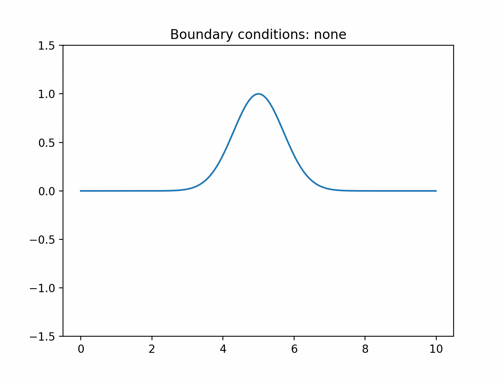
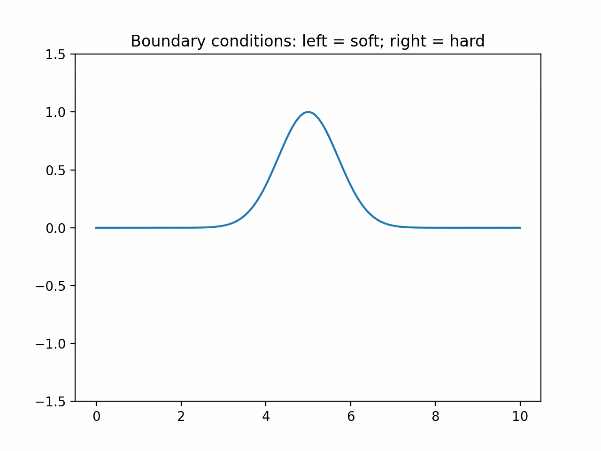

# Hyperbolic Spectral Solver

> Solver to two famous hyperbolic PDEs (wave and advection equations) using spectral methods.

This is my final project for Physics 290 (Computational Physics) at Oberlin College.

## Motivation

Before doing this project, I had research experience in working with parabolic and elliptic PDEs using finite difference methods. My motivation in doing this project was to learn more about hyperbolic PDEs and spectral methods.

## File descriptions

- `spectral.py`: provides functions for taking spectral derivatives and applying spectral filtering.

- `derivative_test.py`: tests spectral method by checking derivative of a known function.

- `advection_equation.py`: solves the advection PDE.

- `wave_equation.py`: solves the wave PDE.

## Advection Equation

### High-level description of algorithm

- Use spectral method for spatial derivatives
- Evolve field using Runge-Kutta 4

## Wave Equation

### High-level description of algorithm

- Use characteristic decomposition to get a system of 3 first-order PDEs
- Use spectral method for spatial derivatives (with spectral filtering)
- Evolve fields using Runge-Kutta 4

## Results from Wave Equation

- Notation for boundary conditions
	- **none**: no special treatment
	- **soft**: wave gets reflected in phase (allowed to oscillate)
	- **hard**: wave gets reflected out of phase (fixed to 0)

### Positive Gaussian waves

> Observation: Some energy is being lost at the boundaries with hard reflections. This could be because of the spectral filtering. Without spectral filtering, the amplitudes increase incredibly fast.

### Positive and Negative Gaussian waves

> Observation: Many weird behaviors occur, especially in the soft-hard case. At the time of writing, it is unclear whether this is a bug or an instability that needs to be addressed some other way.

